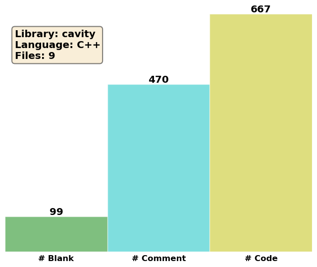

Cavities
========

We will here describe the inheritance hierarchy for generating cavities, in
order to use and extend it properly.  The runtime creation of cavity objects
relies on the Factory Method pattern :cite:`Gamma1994,Alexandrescu2001`,
implemented through the generic Factory class.

ICavity
-------
.. doxygenclass:: pcm::ICavity
   :project: PCMSolver
   :members:
   :protected-members:
   :private-members:

GePolCavity
-----------

.. doxygenclass:: pcm::cavity::GePolCavity
   :project: PCMSolver
   :members:
   :protected-members:
   :private-members:

RestartCavity
-------------

.. doxygenclass:: pcm::cavity::RestartCavity
   :project: PCMSolver
   :members:
   :protected-members:
   :private-members:
