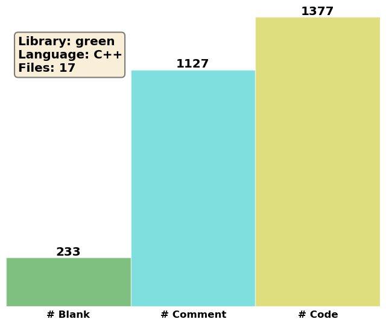

Green's Functions
=================

We will here describe the inheritance hierarchy for generating Green's
functions, in order to use and extend it properly.  The runtime creation of
Green's functions objects relies on the Factory Method pattern
:cite:`Gamma1994,Alexandrescu2001`, implemented through the
generic Factory class.

IGreensFunction
---------------

.. doxygenclass:: IGreensFunction
   :project: PCMSolver
   :members:
   :protected-members:
   :private-members:

GreensFunction
--------------
.. doxygenclass:: GreensFunction
   :project: PCMSolver
   :members:
   :protected-members:
   :private-members:

Vacuum
------
.. doxygenclass:: Vacuum
   :project: PCMSolver
   :members:
   :protected-members:
   :private-members:

UniformDielectric
-----------------
.. doxygenclass:: UniformDielectric
   :project: PCMSolver
   :members:
   :protected-members:
   :private-members:

IonicLiquid
-----------
.. doxygenclass:: IonicLiquid
   :project: PCMSolver
   :members:
   :protected-members:
   :private-members:

AnisotropicLiquid
-----------------
.. doxygenclass:: AnisotropicLiquid
   :project: PCMSolver
   :members:
   :protected-members:
   :private-members:

SphericalDiffuse
----------------
.. doxygenclass:: SphericalDiffuse
   :project: PCMSolver
   :members:
   :protected-members:
   :private-members:
