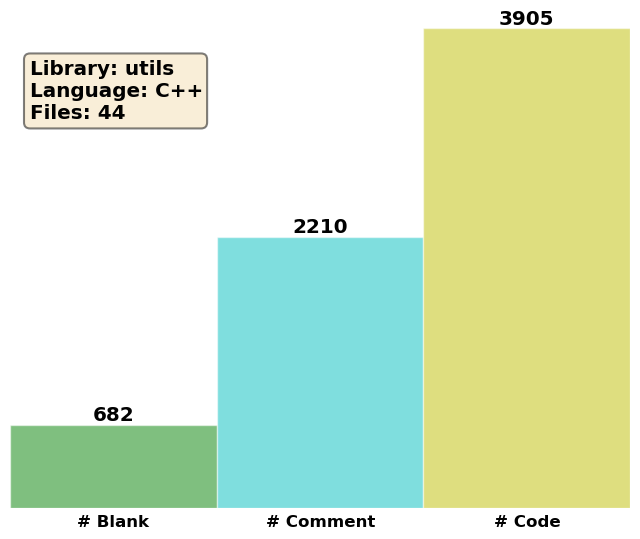

Helper classes and functions
============================

Sphere
------
.. doxygenstruct:: pcm::utils::Sphere
   :project: PCMSolver
   :members:
   :protected-members:
   :private-members:

Atom
----
.. doxygenstruct:: pcm::utils::Atom
   :project: PCMSolver
   :members:
   :protected-members:
   :private-members:

ChargeDistribution
------------------
.. doxygenstruct:: pcm::utils::ChargeDistribution
   :project: PCMSolver
   :members:
   :protected-members:
   :private-members:

Molecule
--------
.. doxygenclass:: pcm::Molecule
   :project: PCMSolver
   :members:
   :protected-members:
   :private-members:

Solvent
-------
.. doxygenstruct:: pcm::utils::Solvent
   :project: PCMSolver
   :members:
   :protected-members:
   :private-members:

Symmetry
--------
.. doxygenclass:: Symmetry
   :project: PCMSolver
   :members:
   :protected-members:
   :private-members:

Mathematical utilities
----------------------
.. doxygenfile:: MathUtils.hpp
   :project: PCMSolver
