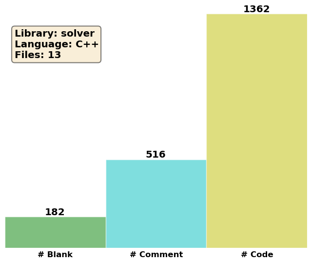

Solvers
=======

We will here describe the inheritance hierarchy for generating solvers, in
order to use and extend it properly.  The runtime creation of solver objects
relies on the Factory Method pattern :cite:`Gamma1994,Alexandrescu2001`,
implemented through the generic Factory class.

PCMSolver
---------
.. doxygenclass:: PCMSolver
   :project: PCMSolver
   :members:
   :protected-members:
   :private-members:

IEFSolver
---------
.. doxygenclass:: IEFSolver
   :project: PCMSolver
   :members:
   :protected-members:
   :private-members:

CPCMSolver
----------
.. doxygenclass:: CPCMSolver
   :project: PCMSolver
   :members:
   :protected-members:
   :private-members:
