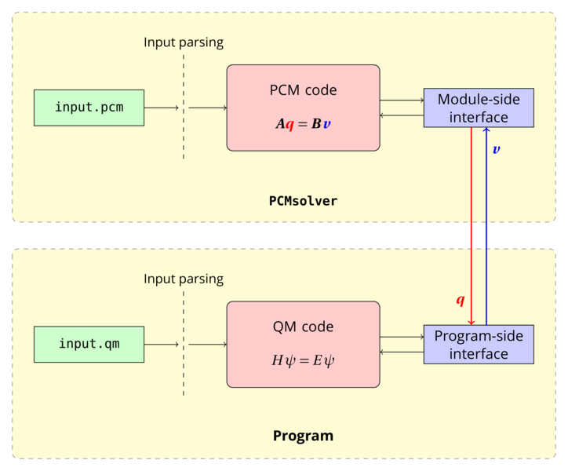

.. PCMSolver documentation master file, created by
   sphinx-quickstart on Mon Oct 26 15:18:26 2015.
   You can adapt this file completely to your liking, but it should at least
   contain the root `toctree` directive.

Welcome to PCMSolver's documentation!
=====================================

This is the documentation for the PCMSolver application programming interface.
PCMSolver is an API for solving the Polarizable Continuum Model electrostatic problem :cite:`Tomasi2005`

With PCMSolver we aim to:

1. provide a plug-and-play library for adding the PCM functionality to *any* quantum chemistry program;

2. create a playground for easily extending the implementation of the model.

PCMSolver is distributed under the terms of the GNU Lesser General Public License.
An archive with the currently released source can be found on `GitHub <https://github.com/PCMSolver/pcmsolver/releases>`_.

.. literalinclude:: snippets/citation.bib
   :language: tex

PCMSolver has been added to the following quantum chemistry programs

+ `Psi4 <http://www.psicode.org/>`_
+ `DALTON <http://daltonprogram.org/>`_
+ `LSDALTON <http://daltonprogram.org/>`_
+ `DIRAC <http://www.diracprogram.org/>`_
+ `ReSpect <http://www.respectprogram.org/>`_
+ `KOALA <https://dx.doi.org/10.1002/jcc.23679>`_

Don't see you code listed here? `Please contact us <roberto.d.remigio@uit.no>`_.

.. toctree::
   :caption: Table of Contents
   :name: mastertoc
   :hidden:

   users/users-manual
   publications
   programmers/programmers-manual
   code-reference/classes-and-functions
   zreferences

Indices and tables
==================

* :ref:`genindex`
* :ref:`modindex`
* :ref:`search`
