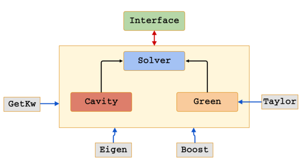

General Structure
=================

External libraries:

+ parts of the C++ `Boost <http://www.boost.org/>`_ libraries are used to provide
  various functionality, like ordinary differential equations integrators.
  The source for the 1.54.0 release is shipped with the
  module's source code. Some of the libraries used
  need to be compiled. Boost is released under the terms
  of the `Boost Software License, v1.0 <http://opensource.org/licenses/BSL-1.0>`_ (see also
  http://www.boost.org/users/license.html)

  .. warning::

     As of v1.1.11 we have started removing the dependency from Boost.
     The use of Boost is thus deprecated.

+ the `Eigen <http://eigen.tuxfamily.org/index.php?title=Main_Page>`_ template
  library for linear algebra.  Almost every operation involving matrices and
  vectors is performed through Eigen.  Eigen provides convenient type
  definitions for vectors and matrices (of arbitrary dimensions) and the
  corresponding operations. Have a look
  `here <http://eigen.tuxfamily.org/dox/group__QuickRefPage.html>`_ for a quick
  reference guide to the API and
  at the `getting started guide <http://eigen.tuxfamily.org/dox/GettingStarted.html>`_ to get started.
  Eigen is distributed under the terms of the `Mozilla Public License, v2.0
  <http://opensource.org/licenses/MPL-2.0>`_
+ the `Getkw library <https://github.com/juselius/libgetkw>`_ by Jonas Juselius is
  used to manage input.  It is distributed under the terms of the `GNU General
  Public License, v2.0 <http://opensource.org/licenses/GPL-2.0>`_
+ the `libtaylor <https://github.com/uekstrom/libtaylor>`_ library implementing automatic differentiation and available
  under the terms of the `MIT License <(http://opensource.org/licenses/MIT>`_.

Third-party code snippets:

+ Fortran subroutines `dsyevv3`, `dsyevh3`, `dsyevj3` for the diagonalization
  of 3x3 Hermitian matrices.  These subroutines were copied verbatim from the
  source code provided by `Joachim Kopp <http://www.mpi-hd.mpg.de/personalhomes/globes/3x3/>`_
  and described in :cite:`KOPP2008` (also available on the `arXiv <http://arxiv.org/abs/physics/0610206>`_) The diagonalization
  subroutines are made available under the terms of the `GNU Lesser General
  Public License, v2.1 <http://opensource.org/licenses/LGPL-2.1>`_
+ C++ cnpy library for saving arrays in C++ into Numpy arrays. The library is
  from `Carl Rogers <https://github.com/rogersce/cnpy>`_ under the terms of the
  `MIT License <(http://opensource.org/licenses/MIT>`_.
  The version in PCMSolver is slightly different.
