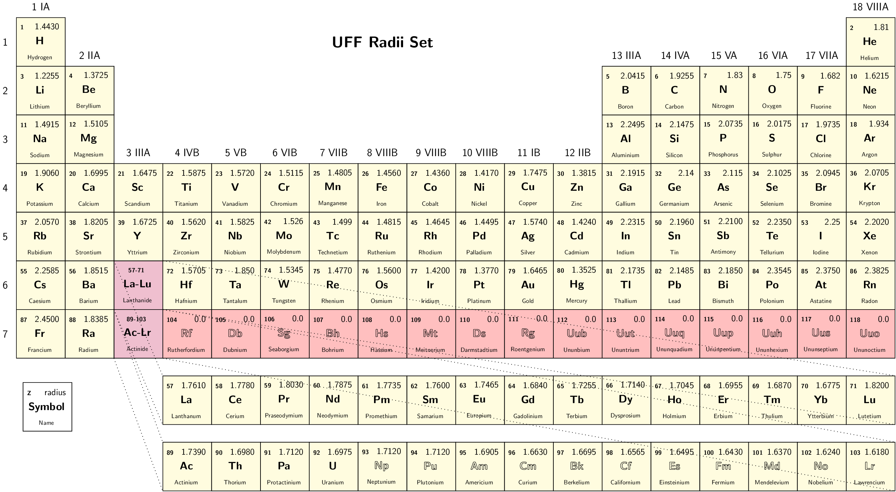
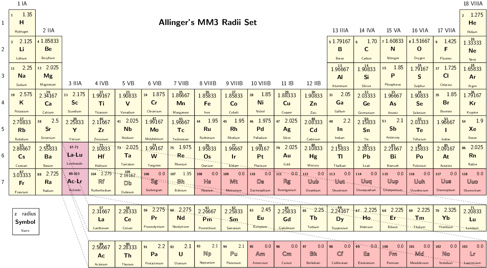

Input description
=================

PCMSolver needs a number of input parameters at runtime. The API provides two
ways of providing them:

1. by means of an additional input file, parsed by the ``pcmsolver.py`` script;
2. by means of a special section in the host program input.

Method 1 is more flexible: all parameters that can be modified by the user
are available.  The host program needs only copy the additional input file to
the scratch directory before execution.  Method 2 just gives access to the
core parameters.

In this page, input style and input parameters available in Method 1 will be
documented.

Note that it is also possible to run the module standalone and use a classical charge
distribution.
The classical charge distribution can be specified by giving a molecular geometry
in the molecule section and an additional point multipoles distribution
in the charge distribution section.
The ``run_pcm.x`` executable has to be compiled for a standalone run with:

.. code-block:: bash

   python pcmsolver.py -x molecule.inp

where the ``molecule.inp`` input file looks like:

.. literalinclude:: ../snippets/molecule.inp

Input style
-----------

The input for PCMSolver is parsed through the `Getkw
<https://github.com/juselius/libgetkw>`_ library written by Jonas Juselius
and is organized in **sections** and **keywords**.  Input reading is
case-insensitive. An example input structure is shown below, there are also
some working examples in the directory ``examples``.  A general input
parameter has the following form (Keyword = [Data type]):

.. literalinclude:: ../snippets/example_input-all.inp

Array-valued keywords will expect the array to be given in comma-separated
format and enclosed in square brackets. The purpose of tags is to distinguish
between cases in which multiple instances of the same kind of object can be
managed by the program.  There exist only certain legal tagnames and these
are determined in the C++ code.  Be aware that the input parsing script does
not check the correctness of tags.

Input parameters
================

Available sections:

+ top section: sets up parameters affecting the module globally;
+ Cavity: sets up all information needed to form the cavity and discretize
  its surface;
+ Medium: sets up the solver to be used and the properties of the medium,
  i.e. the Green's functions inside and outside the cavity;
+ Green, subsection of medium. Sets up the Green's function inside and
  outside the cavity.
+ Molecule: molecular geometry to be used in a standalone run.
+ ChargeDistribution: sets up a classical multipolar (currently up to dipoles)
  charge distribution to use as additional source of electrostatic potential.

.. note::

   The Molecule and ChargeDistribution sections only make sense in a standalone run,
   i.e. when using the ``run_pcm.x`` executable.

.. warning::

   Exactly matching results obtained from implementations of IEFPCM and/or
   CPCM (COSMO) given in other program packages requires careful selection of
   all the parameters involved.
   A partial checklist of parameters you should always keep in mind:

   * solvent permittivities (static and optical)
   * atomic radii set
   * scaling of the atomic radii
   * cavity surface
   * cavity partition (tesselation)
   * PCM matrix formation algorithm
   * strategy used to solve the PCM linear equations system.

Top section keywords
--------------------

.. glossary::

   Units
      Units of measure used in the input file. If Angstrom is given, all
      relevant input parameters are first converted in au and subsequently
      parsed.

      * **Type**: string
      * **Valid values**: AU | Angstrom
      * **Default**: No Default

   CODATA
      Set of fundamental physical constants to be used in the module.

      * **Type**: integer
      * **Valid values**: 2010 | 2006 | 2002 | 1998
      * **Default**: 2010

Cavity section keywords
-----------------------

.. glossary::

   Type
     The type of the cavity. Completely specifies type of molecular surface
     and its discretization.  Only one type is allowed.  Restart cavity will
     read the file specified by NpzFile keyword and create a GePol cavity
     from that.

     * **Type**: string
     * **Valid values**: GePol | Restart
     * **Default**: none

   NpzFile
     The name of the ``.npz`` file to be used for the GePol cavity restart.

     * **Type**: string
     * **Default**: empty string

   Area
     Average area (weight) of the surface partition for the GePol (TsLess)
     cavity.

     * **Type**: double
     * **Valid values**: :math:`d \geq 0.01\,\text{a.u.}^2`
     * **Valid for**: GePol cavity
     * **Default value**: :math:`0.3\,\text{a.u.}^2`

   Scaling
     If true, the radii for the spheres will be scaled by 1.2. For finer
     control on the scaling factor for each sphere, select explicit creation
     mode.

     * **Type**: bool
     * **Valid for**: all cavities except Restart
     * **Default value**: True

   RadiiSet
     Select set of atomic radii to be used. Currently Bondi-Mantina
     :cite:`Bondi1964,Mantina2009`, UFF :cite:`Rappe1992` and Allinger's MM3
     :cite:`Allinger1994-tx` sets available, see :ref:`available-radii`.

     * **Type**: string
     * **Valid values**: Bondi | UFF | Allinger
     * **Valid for**: all cavities except Restart
     * **Default value**: Bondi

     .. note::

        Radii in Allinger's MM3 set are obtained by **dividing** the value in the original
        paper by 1.2, as done in the `ADF COSMO implementation <https://www.scm.com/doc/ADF/Input/COSMO.html>`_
        We advise to turn off scaling of the radii by 1.2 when using this set.

   MinRadius
     Minimal radius for additional spheres not centered on atoms. An
     arbitrarily big value is equivalent to switching off the use of added
     spheres, which is the default.

     * **Type**: double
     * **Valid values**: :math:`d \geq 0.4\,\text{a.u.}`
     * **Valid for**: GePol cavity
     * **Default value**: :math:`100.0\,\text{a.u.}`

   Mode
     How to create the list of spheres for the generation of the molecular
     surface:

     + in Implicit mode, the atomic coordinates and charges will be obtained
       from the QM host program.  Spheres will be centered on the atoms and
       the atomic radii, as specified in one the built-in sets, will be used.
       Scaling by 1.2 will be applied according to the keyword Scaling;
     + in Atoms mode, the atomic coordinates and charges will be obtained
       from the QM host program.  For the atoms specified by the array given
       in keyword Atoms, the built-in radii will be substituted by the radii
       provided in the keyword Radii.  Scaling by 1.2 will be applied
       according to the keyword Scaling;
     + in Explicit mode, both centers and radii of the spheres are to be
       specified in the keyword Spheres.  The user has full control over the
       generation of the list of spheres. Scaling by 1.2 is **not** applied,
       regardless of the value of the Scaling keyword.

     * **Type**: string
     * **Valid values**: Implicit | Atoms | Explicit
     * **Valid for**: all cavities except Restart
     * **Default value**: Implicit

   Atoms
     Array of atoms whose radius has to be substituted by a custom value.

     * **Type**: array of integers
     * **Valid for**: all cavities except Restart

   Radii
     Array of radii replacing the built-in values for the selected atoms.

     * **Type**: array of doubles
     * **Valid for**: all cavities except Restart

   Spheres
     Array of coordinates and centers for construction of the list of spheres
     in explicit mode.  Format is :math:`[\ldots, x_i, y_i, z_i, R_i, \ldots]`

     * **Type**: array of doubles
     * **Valid for**: all cavities except Restart

Medium section keywords
-----------------------

.. glossary::

   SolverType
     Type of solver to be used. All solvers are based on the Integral Equation Formulation of
     the Polarizable Continuum Model :cite:`Cances1998`

     + IEFPCM. Collocation solver for a general dielectric medium
     + CPCM. Collocation solver for a conductor-like approximation to the dielectric medium

     * **Type**: string
     * **Valid values**: IEFPCM | CPCM
     * **Default value**: IEFPCM

   Nonequilibrium
     Initializes an additional solver using the dynamic permittivity.
     To be used in response calculations.

     * **Type**: bool
     * **Valid for**: all solvers
     * **Default value**: False

   Solvent
     Specification of the dielectric medium outside the cavity. This keyword
     **must always** be given a value.
     If the solvent name given is different from Explicit any other settings in
     the Green's function section will be overridden by the built-in values for
     the solvent specified. See Table :ref:`available-solvents` for details.
     ``Solvent = Explicit``, triggers parsing of the Green's function sections.

     * **Type**: string
     * **Valid values**:

        + Water                , H2O;
        + Propylene Carbonate  , C4H6O3;
        + Dimethylsulfoxide    , DMSO;
        + Nitromethane         , CH3NO2;
        + Acetonitrile         , CH3CN;
        + Methanol             , CH3OH;
        + Ethanol              , CH3CH2OH;
        + Acetone              , C2H6CO;
        + 1,2-Dichloroethane   , C2H4CL2;
        + Methylenechloride    , CH2CL2;
        + Tetrahydrofurane     , THF;
        + Aniline              , C6H5NH2;
        + Chlorobenzene        , C6H5CL;
        + Chloroform           , CHCL3;
        + Toluene              , C6H5CH3;
        + 1,4-Dioxane          , C4H8O2;
        + Benzene              , C6H6;
        + Carbon Tetrachloride , CCL4;
        + Cyclohexane          , C6H12;
        + N-heptane            , C7H16;
        + Explicit.

   MatrixSymm
     If True, the PCM matrix obtained by the IEFPCM collocation solver is
     symmetrized :math:`\mathbf{K} := \frac{\mathbf{K} + \mathbf{K}^\dagger}{2}`

     * **Type**: bool
     * **Valid for**: IEFPCM solver
     * **Default**: True

   Correction
     Correction, :math:`k` for the apparent surface charge scaling factor in the
     CPCM solver :math:`f(\varepsilon) = \frac{\varepsilon - 1}{\varepsilon +
     k}`

     * **Type**: double
     * **Valid values**: :math:`k > 0.0`
     * **Valid for**: CPCM solver
     * **Default**: 0.0

   DiagonalIntegrator
     Type of integrator for the diagonal of the boundary integral operators

     * **Type**: string
     * **Valid values**: COLLOCATION
     * **Valid for**: IEFPCM, CPCM
     * **Default**: COLLOCATION
     * **Notes**: in future releases we will add PURISIMA and NUMERICAL as options

   DiagonalScaling
     Scaling factor for diagonal of collocation matrices

     * **Type**: double
     * **Valid values**: :math:`f > 0.0`
     * **Valid for**: IEFPCM, CPCM
     * **Default**: 1.07
     * **Notes**: values commonly used in the literature are 1.07 and 1.0694

   ProbeRadius
     Radius of the spherical probe approximating a solvent molecule. Used for
     generating the solvent-excluded surface (SES) or an approximation of it.
     Overridden by the built-in value for the chosen solvent.

     * **Type**: double
     * **Valid values**: :math:`d \in [0.1, 100.0]\,\text{a.u.}`
     * **Valid for**: all solvers
     * **Default**: 1.0

Green section keywords
----------------------

If ``Solvent = Explicit``, **two** Green's functions sections must be specified
with tags ``inside`` and ``outside``, i.e. ``Green<inside>`` and
``Green<outside>``.  The Green's function inside will always be the vacuum,
while the Green's function outside might vary.

.. glossary::

   Type
     Which Green's function characterizes the medium.

     * **Type**: string
     * **Valid values**: Vacuum | UniformDielectric | SphericalDiffuse
     * **Default**: Vacuum

   Der
     How to calculate the directional derivatives of the Green's function:

       + Numerical, perform numerical differentiation **debug option**;
       + Derivative, use automatic differentiation to get the directional derivative;
       + Gradient, use automatic differentiation to get the full gradient **debug option**;
       + Hessian, use automatic differentiation to get the full hessian **debug option**;

     * **Type**: string
     * **Valid values**: Numerical | Derivative | Gradient | Hessian
     * **Default**: Derivative

     .. note::

        The spherical diffuse Green's function **always** uses numerical differentiation.

   Eps
     Static dielectric permittivity of the medium

     * **Type**: double
     * **Valid values**: :math:`\varepsilon \geq 1.0`
     * **Default**: 1.0

   EpsDyn
     Dynamic dielectric permittivity of the medium

     * **Type**: double
     * **Valid values**: :math:`\varepsilon \geq 1.0`
     * **Default**: 1.0

    Profile
      Functional form of the dielectric profile

      * **Type**: string
      * **Valid values**: Tanh | Erf
      * **Valid for**: SphericalDiffuse
      * **Default**: Tanh

   Eps1
     Static dielectric permittivity inside the interface

     * **Type**: double
     * **Valid values**: :math:`\varepsilon \geq 1.0`
     * **Default**: 1.0

   EpsDyn1
     Dynamic dielectric permittivity inside the interface

     * **Type**: double
     * **Valid values**: :math:`\varepsilon \geq 1.0`
     * **Default**: 1.0

   Eps2
     Static dielectric permittivity outside the interface

     * **Type**: double
     * **Valid values**: :math:`\varepsilon \geq 1.0`
     * **Default**: 1.0

   EpsDyn2
     Dynamic dielectric permittivity outside the interface

     * **Type**: double
     * **Valid values**: :math:`\varepsilon \geq 1.0`
     * **Default**: 1.0

   Center
     Center of the interface layer. This corresponds to the radius
     of the spherical droplet.

     * **Type**: double
     * **Valid for**: SphericalDiffuse
     * **Default**: 100.0 a.u.

   Width
     Physical width of the interface layer. This value is divided by 6.0
     internally.

     * **Type**: double
     * **Valid for**: SphericalDiffuse
     * **Default**: 5.0 a.u.

     .. warning::

        Numerical instabilities may arise if a too small value is selected.

   InterfaceOrigin
     Center of the spherical droplet

     * **Type**: array of doubles
     * **Valid for**: SphericalDiffuse
     * **Default**: :math:`[0.0, 0.0, 0.0]`

   MaxL
     Maximum value of the angular momentum in the expansion of the
     Green's function for the spherical diffuse Green's function

     * **Type**: integer
     * **Valid for**: SphericalDiffuse
     * **Default**: 30

Molecule section keywords
-------------------------

It is possible to run the module standalone and use a classical charge
distribution as specified in this section of the input.
The ``run_pcm.x`` executable has to be compiled for a standalone run with:

.. code-block:: bash

   python pcmsolver.py -x molecule.inp

where the ``molecule.inp`` input file looks like:

.. literalinclude:: ../snippets/molecule.inp

.. glossary::

   Geometry
     Coordinates and charges of the molecular aggregate.
     Format is :math:`[\ldots, x_i, y_i, z_i, Q_i, \ldots]`
     Charges are always assumed to be in atomic units

     * **Type**: array of doubles

ChargeDistribution section keywords
-----------------------------------

Set a classical charge distribution, inside or outside the cavity
No additional spheres will be generated.

.. glossary::

   Monopoles
     Array of point charges
     Format is :math:`[\ldots, x_i, y_i, z_i, Q_i, \ldots]`

     * **Type**: array of doubles

   Dipoles
     Array of point dipoles.
     Format is :math:`[\ldots, x_i, y_i, z_i, \mu_{x_i}, \mu_{y_i}, \mu_{z_i} \ldots]`
     The dipole moment components are always read in atomic units.

     * **Type**: array of doubles

.. _available-radii:

Available radii
---------------

.. image::  ../gfx/bondi_mantina.png
   :scale: 70 %
   :align: center

.. _available-solvents:

Available solvents
------------------

The macroscopic properties for the built-in list of solvents are:

  + static permittivity, :math:`\varepsilon_s`
  + optical permittivity, :math:`\varepsilon_\infty`
  + probe radius, :math:`r_\mathrm{probe}` in Angstrom.

The following table summarizes the built-in solvents and their properties.
Solvents are ordered by decreasing static permittivity.

 ==================== ======== ===================== ========================== ========================
 Name                 Formula  :math:`\varepsilon_s` :math:`\varepsilon_\infty` :math:`r_\mathrm{probe}`
 ==================== ======== ===================== ========================== ========================
 Water                H2O              78.39                 1.776                     1.385
 Propylene Carbonate  C4H6O3           64.96                 2.019                     1.385
 Dimethylsulfoxide    DMSO             46.7                  2.179                     2.455
 Nitromethane         CH3NO2           38.20                 1.904                     2.155
 Acetonitrile         CH3CN            36.64                 1.806                     2.155
 Methanol             CH3OH            32.63                 1.758                     1.855
 Ethanol              CH3CH2OH         24.55                 1.847                     2.180
 Acetone              C2H6CO           20.7                  1.841                     2.38
 1,2-Dichloroethane   C2H4Cl2          10.36                 2.085                     2.505
 Methylenechloride    CH2Cl2            8.93                 2.020                     2.27
 Tetrahydrofurane     THF               7.58                 1.971                     2.9
 Aniline              C6H5NH2           6.89                 2.506                     2.80
 Chlorobenzene        C6H5Cl            5.621                2.320                     2.805
 Chloroform           CHCl3             4.90                 2.085                     2.48
 Toluene              C6H5CH3           2.379                2.232                     2.82
 1,4-Dioxane          C4H8O2            2.250                2.023                     2.630
 Benzene              C6H6              2.247                2.244                     2.630
 Carbon tetrachloride CCl4              2.228                2.129                     2.685
 Cyclohexane          C6H12             2.023                2.028                     2.815
 N-heptane            C7H16             1.92                 1.918                     3.125
 ==================== ======== ===================== ========================== ========================
